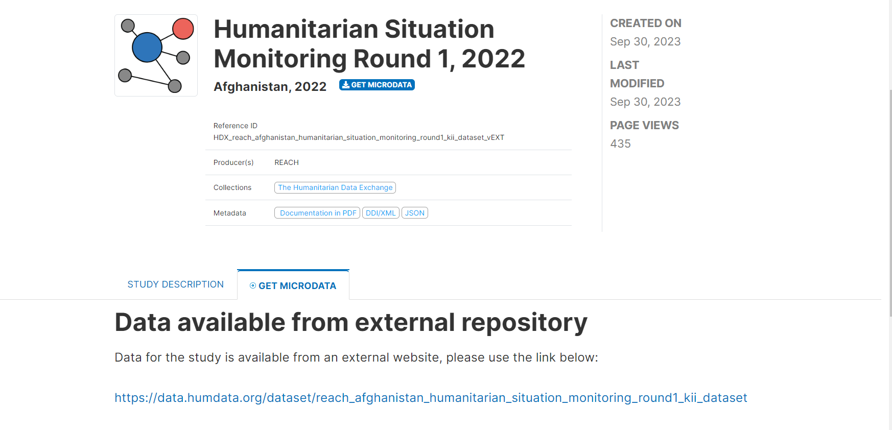

<!-- README.md is generated from README.Rmd. Please edit that file -->

```{r, include = FALSE}
knitr::opts_chunk$set(
  collapse = TRUE,
  comment = "#>",
  fig.path = "man/figures/README-",
  out.width = "100%"
)
```


# microData 

<!-- badges: start -->
[](https://github.com/GutUrago/microData/actions/workflows/R-CMD-check.yaml)
[](https://app.codecov.io/gh/GutUrago/microData?branch=master)
<!-- badges: end -->


##  <span style="color:blue">Update</span>
<span style="color:blue">This package is still under development. This readme explains only the workflow for obtaining results from web scraping functions. However, now the package is able to communicate with the API on its own. This brings many improvements, such as the reliability of the obtained results and a reduction in waiting time. It has the ability to search and filter the results by years, country, collection, access types, repositories, and many others. The package will go beyond what is expounded here after finalization very soon!</span>

## Abstract

The goal of microData is to assist in the process of obtaining complex metadata from datasets provided by different organizations, making life easier. At the moment, it supports four organizations, namely the World Bank, FAO, UNHCR, and IHSN. It can extract the names of available surveys, as well as the necessary metadata. Moreover, it has the ability to assist in obtaining the names of variables from a specific survey along with their labels. It allows you to select only variables that you are interested in and rename them, while assigning variable descriptions as label attributes.

## Installation

You can install the development version of microData from [GitHub](https://github.com/GutUrago/microData) with:

``` r
# install.packages("devtools")
devtools::install_github("GutUrago/microData")
```

## Surveys

This package helps you see all available surveys published by a specific organization. In addition, it returns a data table with four columns. The first column is the country where the survey was collected; the second column is the year; the third column is the catalog number of the survey; and the last column is the title of the survey. Out of these details, the catalog number is used as a unique identifier for the survey throughout the data extraction process.


```{r results='asis', warning=FALSE, message=FALSE}
library(microData)
sv <- surveys(org = "unhcr")
sv |> head() |> kableExtra::kable()

```


## Metadata

You can extract all the details of the files provided by an organization. Sometimes these surveys are from external organizations. In that case, microData cannot extract its metadata. But it still gives a hint as to what to do. For instance, let's try to extract the metadata of the "Humanitarian Situation Monitoring Round 1, 2022" survey collected from Afghanistan in 2022 and published by UNHCR with the unique catalog number '1000'.

```{r eval = FALSE}
metadata(catalog = 1000, org = "unhcr")
# Error in value[[3L]](cond) : 
#  Catalog number 1000 doesn't exist within unhcr organization or no metadata is provided. Check if the data is from external organization using: https://microdata.unhcr.org/index.php/catalog/1000/get-microdata
> 
```

As you can see, it couldn't be extracted. If you read the returned error carefully, it suggests possible solutions. In this case, if we go and visit the link, we see that the data is actually from an external repository.


Let's extract the metadata of the "COVID-19 National Panel Phone Survey 2020, Wave 1" survey collected from Djibouti in 2020 and published by UNHCR with the unique catalog number '397'. It returns five key pieces of information about each data file, such as the description and number of variables. The third column, which is the file name, is very important for the next step.

```{r results='asis'}
md <- metadata(catalog = 397, org = "unhcr")
kableExtra::kable(md)
```


## Dictionary

The function `dictionary()` helps to extract provided variables along with their descriptions using the catalog and file name. The filename argument accepts both the "file name" value and "'File name'?file_name='Data file'". If you are working with a large number of data files, I recommend using the structure that includes 'Data file' because it helps you later identify them while importing.

```{r results='asis'}
dct <- dictionary(catalog = 397, filename = "F1", 
                  org = "unhcr", namecol = FALSE)
# we can also use 
# dictionary(catalog = 397, org = "unhcr",
#            filename = "F1?file_name=ecv_breadwinners_wave1.dta", 
#            namecol = FALSE)

# gt::gt(dct)
kableExtra::kable(dct)
```

# Creating Workbook              

For Excel table manipulations, this package depends on the `openxlsx` package. So, I recommend using that package to organize workbooks instead of this function if you are familiar with its usage.

```{r eval=FALSE}
wb <- new_workbook()    # Run this code only once
```


# Dictionary to Workbook

Multiple dictionary files can be written to the same workbook but on different sheets, as follows: Give descriptive sheet names and don't set the `namecol` argument to `FALSE`. See the documentation for the function.

```{r eval=FALSE}
dictionary(catalog = 397, filename = "F1", 
                  org = "unhcr") |> 
        to_workbook(wb, "breadwinners")
dictionary(catalog = 397, filename = "F1", 
                  org = "unhcr") |> 
        to_workbook(wb, "employment")
```

Then, save your workbook to a local machine.

```{r eval=FALSE}
openxlsx::saveWorkbook(wb, "My workbook.xlsx")
```


# Importing Data

Before importing the data, you have to open Excel and set the names of the variables of interest under the name column. This function only selects variables with the name provided under this column and sets attributes, including new names and descriptions.

```{r eval=FALSE}
my_data <- import_csv(data = "ecv_breadwinners_wave1.dta", 
                      excel = "My workbook.xlsx", 
                      sheet = "breadwinners")
```


# The End!
